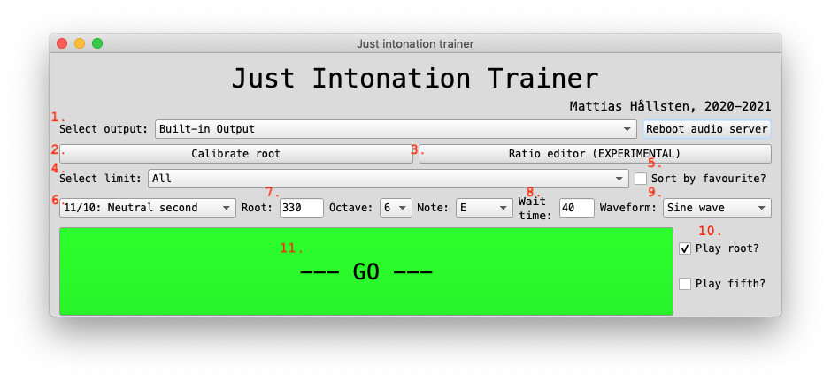
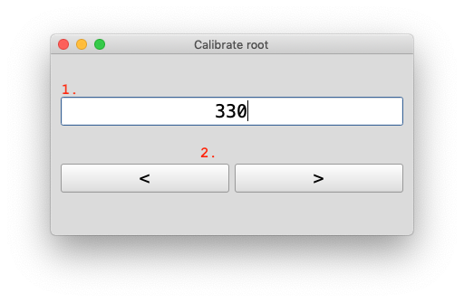
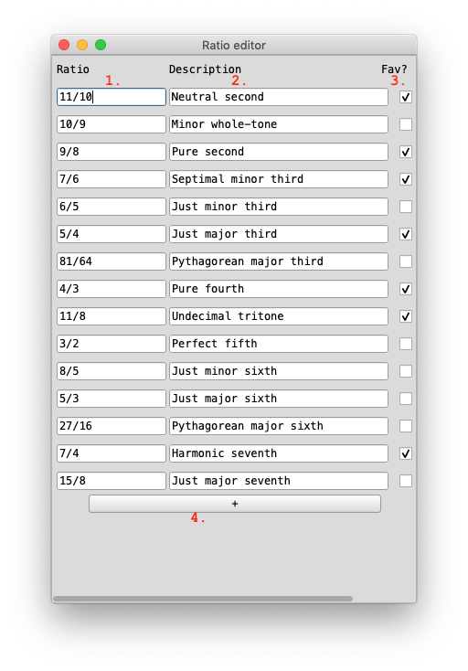

# Just intonation trainer

## Dependencies

- My `Ratio` class, found [here](https://github.com/mattiashallsten/mh-extensions).

## Usage

To run the page, open <parent.scd> in SuperCollider and place the
cursor right under where it says s.waitForBoot. Hit Cmd+Enter on Mac,
Ctrl+Enter on PC.

### Main screen


Upon launching the application, this screen will appear. Here is where you can change a few settings as well as start playing the sine or sawtooth waves.

1. **Select output**: here you can choose between different output
   devices on your system shown in the drop-down menu. After selecting
   a new output, make sure to click the "Reboot audio server" button.
2. **Calibrate root**: opens the root calibration window.
3. **Ratio editor**: opens the ratio editor.
4. **Select limit**: here you can choose to filter the avaiable ratios
   by limit. The limits shown in the drop-down menu are the limits of
   the loaded ratios.
5. **Sort by favourite**: The ratios you add can have a "favourite"
   tag attached to them. If this checkbox is checked, only those
   ratios will show up.
6. **Select ratio**: Here you select what ratio to practice. The
   ratios available are filtered by (4) and (5).
7. **Root note**: Here you can select what will be the root note
   (1/1). This can be decided either by inputing the Hz value
   directly, or by selecting an octave and a note in 12-TET. When
   selecting an octave and note, the Hz will be adjusted, and when
   inputing Hz directly, the nearest note in 12-TET will be displayed.
8. **Wait time**: How much time before the selected ratio will be
   played after hitting the "GO" button.
9. **Waveform**: What waveform to use. Either sine wave or sawtooth wave.
10. **Play root/play fifth**: Whether or not to play the root and
    fifth, respectively.
11. **GO**: Start playing the notes.

### Root calibration screen


When opening this window, a tone of the selected waveform will start playing the root note. This can be used for example to calibrate the application to one of your open strings.

1. **Frequency**: Here you can enter the frequency manually.
2. **"<" and ">" buttons**: Press these buttons to decrease or
   increase the frequency by 1 Hz respectively.
   
### Ratio editor


Here you can interactively add or change ratios. Make sure to hit the Enter key after changing anything.

1. **Ratio**: The ratio. 
2. **Description**: A custom description of the ratio.
3. **Favourite**: Whether or not the ratio is a favourite. Currently
   not working.

## Add ratios

To add ratios you can either open the ratio editor when running the application, or open the file `ratios.json` before running the application and start writing below where it says "Add new ratio here:".

The new ratio must follow the same scheme as the other ones, namely:

```json
{
	"ratio": <ratio>,
	"description": "<description>",
	"limit": <the limit as a whole-number,
	"fav": <1 if it is a favourite, 0 if not"
},
```

Make sure to add the comma at the end, and to have quotation marks around the
description.

## TODO

- [x] Instead of loading an external file for the ratios (`ratios.scd`), write
      the ratios in a `.json` file and parse them in SuperCollider using:
	  
``` supercollider
var file = File.read("ratios.json", "r");
var string = file.readAllString;
 
var ratios = string.parseJSON;
```
 
- [x] Make use of my `Ratio` SuperCollider class to calculate the limit, not
      having the user manually input the limit themselves.
	  
